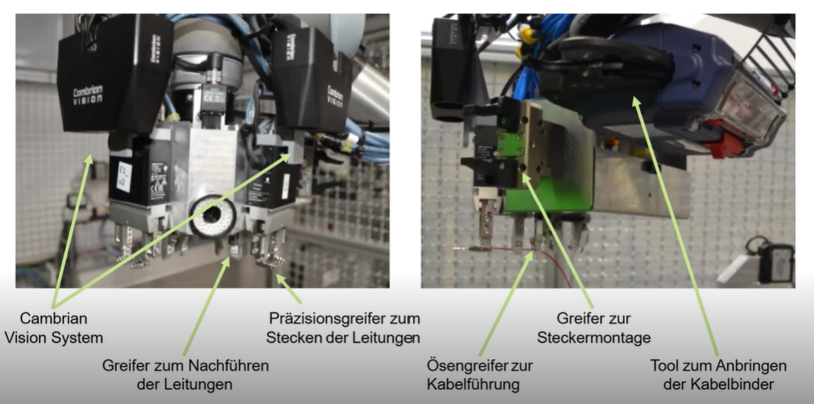
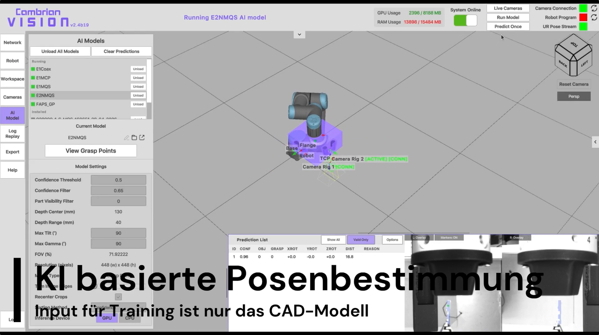
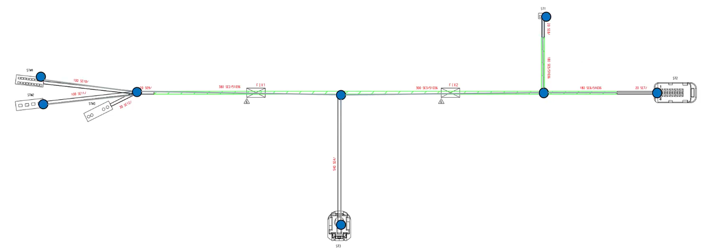
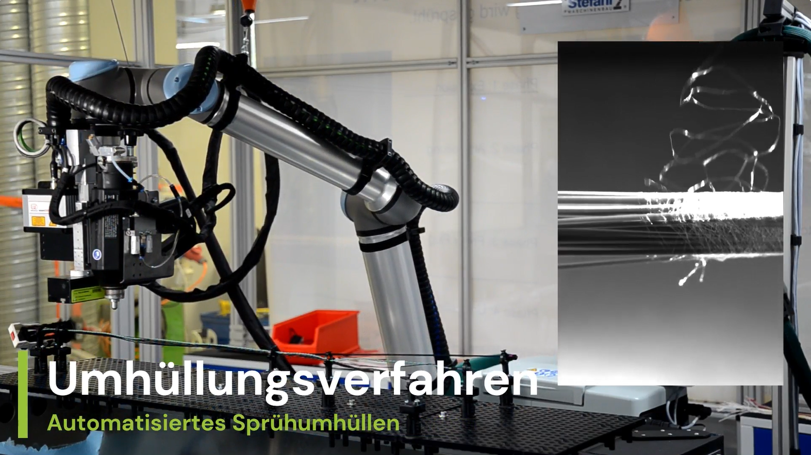

  

Der **Lehrstuhl für Fertigungsautomatisierung und Produktionssystematik (FAPS)** der Friedrich-Alexander-Universität Erlangen-Nürnberg gehört unter der Leitung von Prof. Dr.-Ing. Jörg Franke zu den führenden universitären Forschungseinrichtungen für Automatisierungstechnik und mechatronische Systeme in Deutschland. Rund 100 Mitarbeitende forschen an zukunftsweisenden Technologien – von Robotik und Automatisierungstechnik über Elektronik- und Elektromaschinenproduktion bis hin zu Signal- und Leistungsvernetzung, Engineering-Systemen und Medizintechnik.

Der Forschungsbereich Signal- und Leistungsvernetzung unter der Leitung von Dr. Patrick Bründl legt einen Fokus auf auf der Digitalisierung und Automatisierung der Leitungssatzproduktion. Angesichts zunehmend komplexer Bordnetzarchitekturen bietet dieses Feld enormes Innovationspotenzial, insbesondere durch den gezielten Einsatz von Künstlicher Intelligenz für Bildverarbeitung, Prozessoptimierung und intelligente Robotersteuerung. Der Lehrstuhl verbindet grundlagenorientierte Forschung mit praxisnaher Anwendung; dies spiegelt sich in geförderten Forschungsprojekten wie Next2OEM und der Robotik Challenge ebenso wider wie in zahlreichen direkten Industriekooperationen.

Aufbauend auf dem preisgekrönten Beitrag zur Robotik Challenge 2025 verfolgt der Lehrstuhl FAPS den Ansatz einer vollständigen, durchgängigen Prozesskette: Abgebildet wird nicht nur ein einzelner Prozessschritt, sondern die gesamte Herstellung eines hybriden Leitungssatzmoduls – von der Bereitstellung und dem Stecken der Leitungen über das Routen, das Schließen der Sekundärverriegelung und das Anbringen des Umgehäuses bis zum Sprühumhüllen sowie der Schnittstelle zur Konfektioniermaschine.

Bei Interesse an Kooperationen nehmen Sie gerne Kontakt mit [ Dr. Patrick Bründl](https://www.faps.tf.fau.de/faudir/patrick-bruendl/) auf. 

**Website:** https://www.faps.tf.fau.de/

### Kooperationsmöglichkeiten

Der Lehrstuhl FAPS bietet fünf Arten der Kooperation mit Industrie und weiteren Institutionen:

- **Gefördertes Forschungsprojekt** – Geförderte, gemeinsam beantragte Forschungsaktivität
- **Industrielle Gemeinschaftsforschung** – Forschung durch Institute/Universitäten mit projektbegleitendem Ausschuss
- **Industriepromotion** – Promotion über einen gemeinsamen Mitarbeiter
- **Direkte Kooperation** – Direkter Wissens- und Technologietransfer
- **Studentische Kooperation** – Betreuung einzelner Abschlussarbeiten

**Wir freuen uns auf die Zusammenarbeit.**

## Demonstratoraufbau
 
Der Demonstrator basiert auf einem Universal-Robots-Arm als Plattform. Zur Lage- und Qualitätserkennung kommt ein Cambrian-Vision-System zum Einsatz, zur flexiblen Bauteilzuführung ein Asyril-System. Eine Linearachse bildet die Schnittstelle zur Konfektioniermaschine, während als neuartiges Verfahren zudem das patentierte **Sprühumhüllen** anstelle des konventionellen Tapens eingesetzt wird. Zur Aufzeichnung der Fertigungsdaten ist ein DPP-Orchestrator angebunden.

### Flexible Bauteilzuführung (Asyril)

Die Zuführung der Komponenten erfolgt über eine hoch entwickelte, flexible Zuführlösung aus Asycube (3-Achs-Vibrationstechnologie), Asyfill-Zuführbunker und EYE+-Kamerasystem. Zuführung von Bauteilen von 0,1 – 150 mm, auch komplexe und empfindliche Teile. Multifeeding von bis zu 4 Bauteilen möglich.

### Bereitstellung auf der Linearachse

Die Leitungen werden auf einer Linearachse in die Zelle eingefahren und bereitgestellt. Dabei ist vorgesehen, dass die Linearachse die Schnittstelle zur Konfektioniermaschine bildet: Sie kann aus z.B. der Komax Zeta/Omega zum Roboter fahren und die Leitungen übergeben. Darauf aufbauend besteht die Idee, mehrere Roboterzellen anzuknüpfen, um eine optimale Maschinenauslastung zu erreichen.

### KI-basierte Posenbestimmung und Crimp-Vermessung

Die Lage- und Qualitätserkennung erfolgt als Ergänzung zu 2025 nun über ein hochpräzises Cambrian-Vision-System. Die Posenbestimmung ist KI-basiert – als Eingabe für das Training dient ausschließlich das CAD-Modell des Bauteils. Die Crimpkontakte werden hochpräzise vermessen.

### Routen / Graphenbasierte Optimierung

Die KBL wird mittels Parser in einen Graphen transformiert und anschließend optimal aufgespannt. Das volle Potenzial des Algorithmus entfaltet sich bei größeren Kabelbäumen.

### Werkzeugwechsler – Schlüssel zur Flexibilisierung

Das Vorsehen eines Werkzeugwechslers ermöglicht den Wechsel von Greifern und Werkzeugen, sodass ein Roboter mehrere Aufgaben übernehmen kann: ein Werkzeug zum Leitungsverlegen, ein Werkzeug für Kabelbinder sowie ein Werkzeug fürs Sprühumhüllen, ergänzt durch einen Greifer für Umgehäuse und einen Greifer für die Steckervereinzelung. Diese Flexibilisierung reduziert die Anzahl benötigter Roboter und die Komplexität, vermeidet Auslastungsprobleme wie bei einer verketteten Linienfertigung mit unterschiedlichen Fertigungszeiten und sorgt dafür, dass bei Störungen nicht die gesamte Linie stillsteht.

### Anbringen des Umgehäuses

Das Umgehäuse wird über kraftgeregeltes Fügen angebracht. Ergänzend zur optischen Prüfung kann die Montage von Crimps und Steckern akustisch überwacht werden: Das Einrasten erzeugt ein charakteristisches Klick-Geräusch, dessen Auswertung Rückschlüsse auf einen erfolgreichen oder fehlgeschlagenen Fügevorgang erlaubt. Dass sich eine solche akustische Qualitätsüberprüfung für die Montage von Crimps und Steckern eignet, wurde bereits in zwei Veröffentlichungen des Lehrstuhls gezeigt: zum einen von Nguyen, Javaheri und Franke in „Manipulation of Deformable Linear Objects Enabled by Sound-event Classification in the Manufacturing Environment" (2023 IEEE International Conference on Industrial Engineering and Engineering Management (IEEM)), zum anderen die Weiterentwicklung von Hartmann, Liu, Lamprecht, Bründl und Franke in „AI-Driven Multisensor Quality Inspection: A Focus on Robotic Wire Harness Assembly" (Advances in Production Management Systems (APMS 2025)).

### Sprühumhüllen statt Tapen

Anstelle des konventionellen Tapens kommt ein automatisiertes Sprühumhüllen zum Einsatz: ein berührungsloses Umhüllungsverfahren, das den Montageprozess beschleunigt und flexibler gestaltet. Das Sprühumhüllen wurde bereits vom Lehrstuhl patentiert und wird in Kooperation mit einem Industriepartner weiterentwickelt.

### Herstellen der UTP-Leitungen

Die Twisted-Pair-Leitungen (UTP) werden direkt durch den Roboter aufgespannt und hergestellt. Der genaue Mechanismus des Verdrillvorgangs kann an dieser Stelle nicht im Detail beschrieben werden; das Verfahren ist Gegenstand einer geplanten Patentanmeldung.

## Prozessschritte

Unsere Lösung umfasst folgende **10 Prozessschritte**:

1. Bereitstellung
2. Greifen
3. Orientieren
4. Einstecken des jeweilig ersten Kabelendes
5. Routen
6. Einstecken des jeweilig zweiten Kabelendes
7. Fixieren (Kabelbinder und Sprühumhüllen) 
8. Sekundärverriegelung schließen 
9. Einsetzen Umgehäuse 
10. Aufschieben Kappe

## Zykluszeiten des Prozesses

| Prozess | Anzahl | Taktzeit | Summe |
|---|---:|---:|---:|
| Zuführen der Komponenten | 6 | 10 s | 1 min |
| Stecken und Routen der Leitung | 6 | 23 s | 2 min 16 s |
| Umsetzen der Stecker in das Umgehäuse ¹ | 3 | 14 s | 42 s |
| Anbringen des Umgehäuses | 1 | 16 s | 16 s |
| Sprühumhüllen | 1 | 22 s | 22 s |
| **GESAMTZEIT** | | | **4 min 36 s** |

¹ inkl. Schließen der Sekundärverriegelung

Optional bzw. zusätzlich (nicht in der Gesamtzeit enthalten):

| Prozess | Anzahl | Taktzeit | Summe |
|---|---:|---:|---:|
| Kabelbinder anbringen | 3 | 7 s | 21 s |
| Verdrillen der Leitung | 1 | 49 s | 49 s |

## Kostenkalkulation für den Aufbau der Robotik-Challenge

| Position | Kosten |
|---|---:|
| Roboter | 28.000,00 € |
| Cambrian | 20.000,00 € |
| Roboter-Werkzeug | 10.000,00 € |
| Linearachse | 2.500,00 € |
| Verdrilleinheit für UTP-Leitungen | 500,00 € |
| Sonstiges (Tisch, Formbrett, PC) | 7.000,00 € |
| Schaltschrank und SPS | 7.500,00 € |
| **Zwischenwert** | **75.500,00 €** |

> **Keine Sonderkomponenten**
> Alles zukaufbar & mit gängigen CNG-Maschinen fertigbar

> **Keine Komax Sigma notwendig!**
> **−400.000 €**

## Digitaler Produktpass (DPP) & Begleitforschung

Der Lehrstuhl FAPS beteiligt sich aktiv am **Digitalisierungsmodul** der Robotik Challenge. Während die ARENA2036-Plattform aus den **VEC/KBL-Engineering-Dateien** bereits *Nameplate*, *Bill of Materials (BOM)* und *Handover Documentation* erzeugt, ergänzt der FAPS-Demonstrator diese um **reale Fertigungsdaten aus der Roboterzelle**:

* **Zeitverbrauch** (Taktzeiten)
* **Energieverbrauch** (Strom + Druckluft)
* **Materialverbrauch** (Komponenten-Lots)
* **Prüfergebnisse** (Bild, Audio, Kraft)

### Sensorik an der Anlage

Als Datenkonzept zur vollständigen Erfassung des Fertigungsprozesses sind **sieben Datenquellen** vorgesehen:

| Datenquelle | Erfasste Größen |
|---|---|
| Industriekamera | Crimpqualität, Rastlanzenprüfung, Abschlussbilder |
| Mikrofon | Einrastgeräusche bei Primär- und Sekundärverriegelung |
| Robotersteuerung | Trajektorien, Gelenkwinkel, Einsteckpositionen, Taktzeiten |
| Energiebox (Strom) | Leistungsaufnahme über den Fertigungszyklus |
| Energiebox (Pneumatik) | Druckluftverbrauch der Greifer und Werkzeuge |
| Barcode-Scanner | Losnummern der verbauten Komponenten (Kontakte, Leitungen, Gehäuse) |
| Temperatur / Feuchte | Umgebungsbedingungen während der Fertigung |

### Zielbild: Der angereicherte DPP

Die AAS-Submodellstruktur des Leitungssatzes umfasst bestehende und neue Submodelle:

| Submodell | Quelle | Status |
|---|---|---|
| Nameplate | VEC/KBL | bestehend |
| HierarchicalStructures / BOM | VEC/KBL | bestehend |
| Fertigungsdokumentation (Bilder, Audio, Roboterdaten) | Roboterzelle | **neu** |
| Komponentenrückverfolgbarkeit (Barcode-Scans, Lot-Nummern) | Roboterzelle | **neu** |
| Qualitätsprüfung (elektrischer Durchgangstest, Kraft-Weg-Kurven) | Roboterzelle | **neu** |
| ProductCarbonFootprint (Strom + Druckluft → CO₂-Äquivalent) | Roboterzelle | **neu** |

### DPP-Orchestrator

Die Sensordaten werden lokal über einen **DPP-Orchestrator auf einem Raspberry Pi 4 B** gesammelt, strukturiert abgelegt und in das **AAS-Format** überführt. Die Erzeugung und Anreicherung des Digitalen Produktpasses erfolgt über den noch durch die ARENA zur Verfügung zu stellenden REST-API-Microservice der Robotik Challenge. In der aktuellen Ausbaustufe erfasst der Orchestrator die **Kerndatenquellen Kamera, Mikrofon und Energiemessung**.

### Wissenschaftliche Publikation

Die Arbeiten flossen in eine geplante Veröffentlichung auf der **ETFA 2026** ein: *„Digital Product Passport with Product Carbon Footprint Calculation for the Wiring Harness"* (Beitrag des Lehrstuhls FAPS / FAU). Grundlage sind die bereitgestellten **KBL-/VEC-Datenmodelle** für einen standardisierten, interoperablen DPP auf Basis der **Asset Administration Shell (AAS)**. Details im [DPP-Bereich des Repositories](https://github.com/ARENA2036/THLS-RoboticChallenge/tree/main/RC2026/DPP).

---
**Weitere Informationen:**  
[Transformations-Hub Leitungssatz](https://www.leitungssatz-hub.de)  
[ARENA2036](https://arena2036.de)  
[FAU FAPS](https://www.faps.tf.fau.de/)

---

*Dieses Repository dient der transparenten Bereitstellung der Challenge-Daten und fördert den offenen Innovationsaustausch.*
